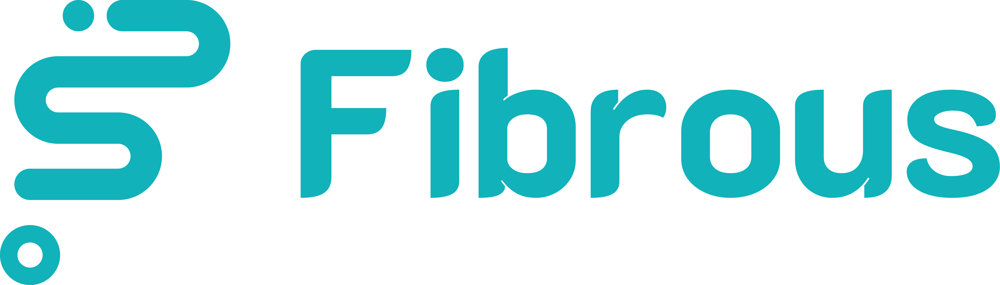

<p align="center">
  <a href="https://fibrous.finance">
    
  </a>
</p>

# Fibrous Finance SDK (v0.6.0)

[Full Documentation](https://docs.fibrous.finance/)

## Usage

Fetching Tokens

```javascript
import { Router as FibrousRouter } from "fibrous-router-sdk";b
const router = new FibrousRouter();
const chainId = router.supportedChains.find(
    (chain) => chain.chain_name == "starknet",
)?.chain_id;
if (!chainId) {
    throw new Error("Chain not supported");
}
const tokens = await router.supportedTokens(chainId);
Map<string, Token>
// Access tokens like: tokens.get("usdc") or tokens.get("eth")
```

Fetching Protocols

```javascript
import { Router as FibrousRouter } from "fibrous-router-sdk";b

const router = new FibrousRouter();
const chainId = router.supportedChains.find(chain => chain.chain_name == "starknet")?.chain_id;
if (!chainId) {
    throw new Error("Chain not supported");
}

const protocols = await router.supportedProtocols(chainId);
console.log(protocols);
```

Fetching route

```javascript
import { Router as FibrousRouter } from "fibrous-router-sdk";
import { parseUnits } from "ethers";

const chainName = "starknet";

const fibrous = new FibrousRouter();
const chainId = fibrous.supportedChains.find(chain => chain.chain_name == "starknet")?.chain_id;
if (!chainId) {
    throw new Error("Chain not supported");
}
// Build route options
const tokens = await fibrous.supportedTokens(chainId);
const inputToken = await fibrous.getToken(
    "0x049d36570d4e46f48e99674bd3fcc84644ddd6b96f7c741b1562b82f9e004dc7", // ETH address
    chainId,
);
if (!inputToken) {
    throw new Error("Input token not found");
}
const tokenInAddress = inputToken.address;
const outputToken = tokens.get("strk"); // this search in only the tokens that are verified
// if you want to search for a token that is not verified, you can use the getToken method
// const outputToken = await fibrous.getToken(
//     "0x04718f5a0fc34cc1af16a1cdee98ffb20c31f5cd61d6ab07201858f4287c938d", // STRK address
//     "starknet",
// );
if (!outputToken) {
    throw new Error("Output token not found");
}
const tokenOutAddress = outputToken.address;
const tokenInDecimals = Number(inputToken.decimals);
const inputAmount = BigInt(parseUnits("0.01", tokenInDecimals)); // 0.01 ETH
const reverse = false;
// Converting 1 ETH to STRK
const route = await fibrous.getBestRoute(
    inputAmount,
    tokenInAddress,
    tokenOutAddress,
    chainName, // chainName will be deprecated in the future, use chainId instead
    {
        reverse: false,
        direct: false,
        excludeProtocols: [],
    },
    chainId,
);
// returns route type (src/types/route.ts)
```

Build transaction on Starknet

```javascript
import { Router as FibrousRouter } from "fibrous-router-sdk";
import { connect, disconnect } from '@argent/get-starknet'
import { Account, Provider } from "starknet";
import { parseUnits } from "ethers";

const fibrous = new FibrousRouter();
const chainId = fibrous.supportedChains.find(chain => chain.chain_name == "starknet")?.chain_id;
if (!chainId) {
    throw new Error("Chain not supported");
}
if (!DESTINATION || !PRIVATE_KEY || !RPC_URL || !PUBLIC_KEY) {
    throw new Error("Missing environment variables");
}

// Get the supported tokens for the Starknet chain
const tokens = await fibrous.supportedTokens(chainId);
/**
 * recommended that use the token address directly
 * because there may be more than one token with the same symbol.
 */
const inputToken = await fibrous.getToken(
    "0x049d36570d4e46f48e99674bd3fcc84644ddd6b96f7c741b1562b82f9e004dc7", // ETH address
    chainId,
);
if (!inputToken) {
    throw new Error("Input token not found");
}
const outputToken = tokens.get("strk"); // this search in only the tokens that are verified
// if you want to search for a token that is not verified, you can use the getToken method
// const outputToken = await fibrous.getToken(
//     "0x04718f5a0fc34cc1af16a1cdee98ffb20c31f5cd61d6ab07201858f4287c938d", // STRK address
//     "starknet",
// );
if (!outputToken) {
    throw new Error("Output token not found");
}
const tokenInAddress = inputToken.address;
const tokenOutAddress = outputToken.address;
const tokenInDecimals = Number(inputToken?.decimals);
if (!tokenInAddress || !tokenOutAddress || !tokenInDecimals) {
    throw new Error("Token not found");
}
const inputAmount = BigInt(parseUnits("0.0001", tokenInDecimals)); // 0.0001 ETH

// Call the buildTransaction method in order to build the transaction
// slippage: The maximum acceptable slippage of the buyAmount amount.
const slippage = 1; // 1%
const {route, calldata} = await fibrous.buildRouteAndCalldata(
    inputAmount,
    tokenInAddress,
    tokenOutAddress,
    slippage,
    DESTINATION,
    chainId,
    {
        reverse: false,
        direct: false,
        excludeProtocols: [],
    },
);

// https://www.starknetjs.com/docs/guides/connect_account
// If this account is based on a Cairo v2 contract (for example OpenZeppelin account 0.7.0 or later), do not forget to add the parameter "1" after the privateKey parameter
const account0 = account(PRIVATE_KEY, PUBLIC_KEY, "1", RPC_URL);
const approveCall: Call = await fibrous.buildApproveStarknet(
    inputAmount,
    tokenInAddress,
);
humanReadableStarknetSwapCallDataLog(
    calldata,
    inputToken,
    outputToken,
    await fibrous.supportedProtocols(chainId),
);

// Type guard: Starknet chains return Call
if ("contractAddress" in calldata && "entrypoint" in calldata) {
    const resp = await account0.execute([approveCall, calldata]);
    console.log(`https://voyager.online/tx/${resp.transaction_hash}`);
} else {
    console.error("Invalid swap call data for Starknet transaction");
}
```

Build Batch transaction on Starknet

```javascript
import { Router as FibrousRouter } from "fibrous-router-sdk";
import { Call } from "starknet";
import { parseUnits } from "ethers";
import { account } from "./account";

const fibrous = new FibrousRouter();
const chainId = fibrous.supportedChains.find(chain => chain.chain_name == "starknet")?.chain_id;
if (!chainId) {
    throw new Error("Chain not supported");
}
// Get the supported tokens for the Starknet chain
const tokens = await fibrous.supportedTokens(chainId);

const ethToken = tokens.get("eth");
const strkToken = tokens.get("strk");
const usdcToken = tokens.get("usdc");
const usdtToken = tokens.get("usdt");

if (!ethToken || !strkToken || !usdcToken || !usdtToken) {
    throw new Error("Required tokens not found");
}

const tokenInAddress_1 = ethToken.address;
const tokenInAddress_2 = strkToken.address;
const tokenInAddress_3 = usdcToken.address;

const tokenOutAddress = usdtToken.address;

const tokenInDecimals_1 = ethToken.decimals;
const tokenInDecimals_2 = strkToken.decimals;
const tokenInDecimals_3 = usdcToken.decimals;

const inputAmounts = [
    BigInt(parseUnits("0.001", tokenInDecimals_1)), // 0.001 ETH
    BigInt(parseUnits("10", tokenInDecimals_2)), // 10 STRK
    BigInt(parseUnits("5", tokenInDecimals_3)), // 5 USDC
];
const public_key = process.env.STARKNET_PUBLIC_KEY;
const privateKey = process.env.STARKNET_PRIVATE_KEY;
const RPC_URL = process.env.STARKNET_RPC_URL;
const destination = process.env.STARKNET_PUBLIC_KEY; // The address to receive the tokens after the swap is completed (required)
if (!privateKey || !public_key || !RPC_URL || !destination) {
    throw new Error("Missing environment variables");
}
// Call the buildTransaction method in order to build the transaction
// slippage: The maximum acceptable slippage of the buyAmount amount.
const slippage = 1; // 1%
const tokenInAddresses = [
    tokenInAddress_1,
    tokenInAddress_2,
    tokenInAddress_3,
];
const tokenOutAddresses = [tokenOutAddress];
const swapCalls = await fibrous.buildBatchTransaction(
    inputAmounts,
    tokenInAddresses,
    tokenOutAddresses,
    slippage,
    destination,
    "starknet", // chainName will be deprecated in the future, use chainId instead
    {reverse: false, direct: false, excludeProtocols: []},
    chainId,
);

// https://www.starknetjs.com/docs/guides/connect_account
// If this account is based on a Cairo v2 contract (for example OpenZeppelin account 0.7.0 or later), do not forget to add the parameter "1" after the privateKey parameter

const account0 = account(privateKey, public_key, "1", RPC_URL);
const approveCalls: Call[] = [];
for (let i = 0; i < inputAmounts.length; i++) {
    const approveCall: Call = await fibrous.buildApproveStarknet(
        inputAmounts[i],
        tokenInAddresses[i],
    );
    approveCalls.push(approveCall);
}
// Type guard: Starknet chains return Call[]
if (
    Array.isArray(swapCalls) &&
    swapCalls.every(
        (call) => "contractAddress" in call && "entrypoint" in call,
    )
) {
    const resp = await account0.execute([...approveCalls, ...swapCalls]);
    console.log(`https://voyager.online/tx/${resp.transaction_hash}`);
} else {
    console.error("Invalid swap call data for Starknet batch transaction");
}

## Contributing

We welcome contributions from the community. Please review our [contributing guidelines](./docs/CONTRIBUTING.md) to get started.

[def]: https://docs.fibrous.finance/
